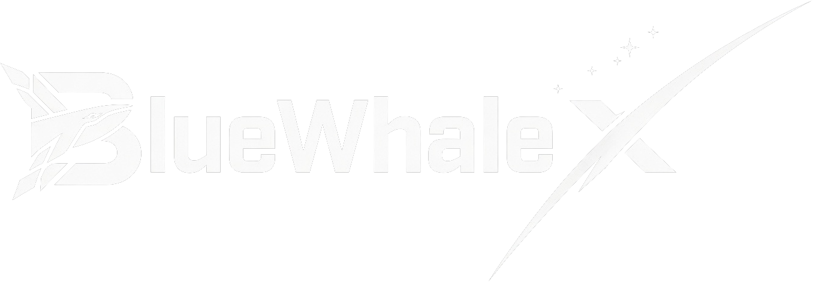
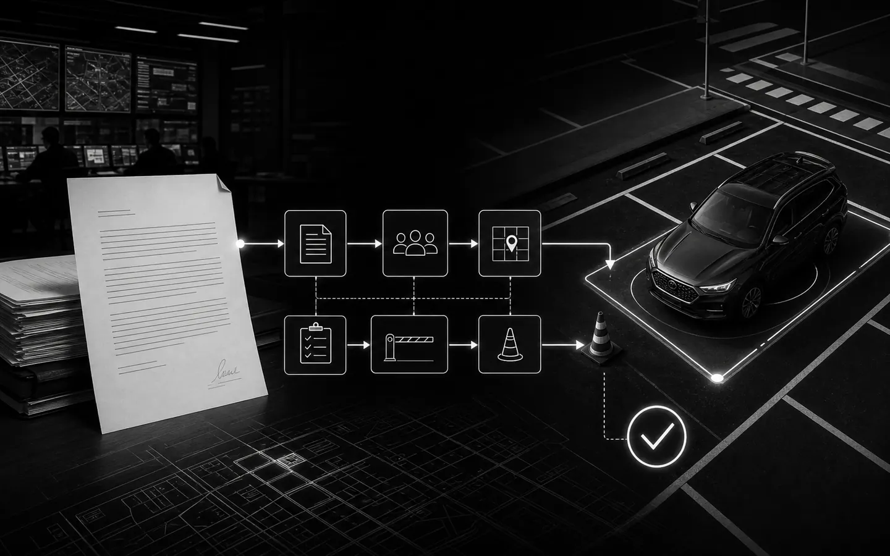
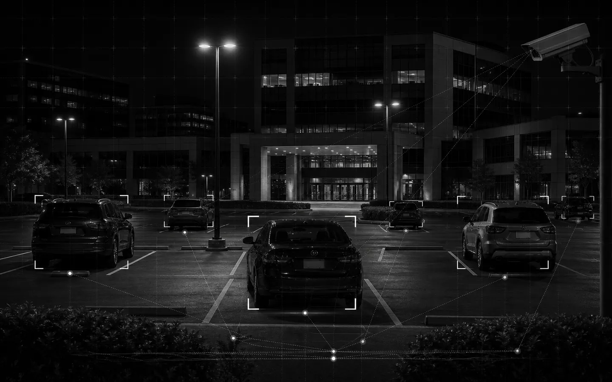

<div align="center">
  
  <h1>BlueWhaleX</h1>
  <p><strong>Technical Operations · Public-Service Systems · Emerging Technology</strong></p>
  <p>A bilingual portfolio by Kittiphum Prasomsap, presenting software designed for real operational work.</p>
  <p>
    
    
    
    <a href="LICENSE"></a>
  </p>
  <p>
    <a href="#featured-projects">Projects</a> ·
    <a href="#portfolio-experience">Experience</a> ·
    <a href="#local-development">Development</a> ·
    <a href="#contact">Contact</a>
  </p>
</div>

---

## Overview

BlueWhaleX is a single-page portfolio for operational software, interactive visualizations, and developer tools.

Each project is presented through its problem, users, workflow, architecture, technology choices, delivery status, and supporting media.

The site uses semantic HTML, CSS, and vanilla JavaScript. It has no framework, package installation, compilation step, or server-side runtime.

## Featured projects

| Project                           | Type and status                       | Core technology                      | Links                                                                                                                |
| --------------------------------- | ------------------------------------- | ------------------------------------ | -------------------------------------------------------------------------------------------------------------------- |
| **NACC Overnight Parking Log**    | Operational system · In service       | Python, Streamlit, Google Sheets     | [Source](https://github.com/Sleepingknight0/naccparking) · [Application sign-in](https://naccparking.streamlit.app/) |
| **NACC Parking Request Platform** | Workflow platform · In service        | TypeScript, Next.js, React, Supabase | [Source](https://github.com/Sleepingknight0/Parking_request) · [Live](https://nacc-parking-user.vercel.app)          |
| **Starlink Mission Control**      | Interactive visualization · Live demo | JavaScript, Three.js, WebGL, Geobuf  | [Source](https://github.com/Sleepingknight0/BWX-STARLINK) · [Live](https://starlink-plum.vercel.app)                 |
| **Chess Vision Assistant**        | Windows desktop application           | Python, PySide6, OpenCV, Stockfish   | [Source](https://github.com/Sleepingknight0/chess-vision-assistant)                                                  |
| **Universal AI CLI Launcher**     | Private Windows developer tool        | PowerShell, JSON, Windows Terminal   | [Case study](projects/universal-ai-cli-launcher/README.md)                                                           |

## Selected project visuals

<table>
  <tr>
    <td width="50%">
      
    </td>
    <td width="50%">
      
    </td>
  </tr>
  <tr>
    <td align="center">
      <strong>Parking Request Platform</strong><br>
      <sub>End-to-end operational workflow</sub>
    </td>
    <td align="center">
      <strong>Overnight Parking Log</strong><br>
      <sub>Field capture and review dashboard</sub>
    </td>
  </tr>
</table>

## Portfolio experience

- English and Thai content backed by stable translation keys.
- Search and filters for project class, technology, and delivery status.
- Project dossiers with architecture, workflow, screenshots, and external links.
- Responsive layouts for desktop, tablet, mobile, mouse, and touch input.
- Keyboard navigation, visible focus, managed dialogs, and reduced-motion support.
- Progressive media loading for large visual assets.

## Technical architecture

| Area                 | Implementation                                                            |
| -------------------- | ------------------------------------------------------------------------- |
| Front end            | Semantic HTML5, CSS custom properties, and vanilla JavaScript             |
| Content              | Structured JavaScript project registry                                    |
| Internationalization | Stable `data-i18n` keys and a localized content dictionary                |
| Responsive behavior  | Fluid layouts, mobile navigation, touch targets, and capability detection |
| Motion               | Progressive enhancement controlled by motion and touch capability flags   |
| Runtime dependency   | Google Fonts                                                              |
| Delivery             | Static hosting                                                            |

## Local development

Clone the repository and serve its root directory:

```bash
git clone https://github.com/Sleepingknight0/bluewhalex-portfolio-v05.git
cd bluewhalex-portfolio-v05
python -m http.server 8000
```

Open `http://localhost:8000/index.html`.

The site should be served over HTTP because media and browser security behavior can differ when files are opened directly.

## Repository structure

```text
.
|-- index.html                         # Canonical source and entry point
|-- bluewhalex-portfolio.html          # Synchronized distribution copy
|-- assets/
|   |-- images/                        # Brand, background, and project media
|   `-- videos/                        # Optimized production video
|-- projects/
|   `-- universal-ai-cli-launcher/     # Public architecture case study
|-- .gitignore                         # Local and generated file policy
|-- LICENSE                            # MIT licence
`-- README.md                          # Project documentation
```

## Content maintenance

Make normal site changes in `index.html`. Every new localized element requires a stable `data-i18n` key and a matching translation entry.

After an approved change, synchronize the distribution copy:

```powershell
Copy-Item index.html bluewhalex-portfolio.html
```

Confirm that both files are identical:

```bash
git diff --no-index index.html bluewhalex-portfolio.html
```

No output means the files match.

## Release checklist

- Review desktop, tablet, and mobile layouts.
- Test both interface languages.
- Verify keyboard navigation, drawer focus, and dialog focus restoration.
- Verify reduced-motion behavior.
- Confirm that local images and videos load successfully.
- Review project links and live demonstrations.
- Confirm that the browser console contains no errors.
- Confirm that `index.html` and `bluewhalex-portfolio.html` are identical.

## Data and media safety

Project media may originate from operational interfaces. Remove personal records, credentials, vehicle registrations, and other sensitive data before committing screenshots or recordings.

## Contact

- **Kittiphum Prasomsap**
- **GitHub:** [@Sleepingknight0](https://github.com/Sleepingknight0)
- **Email:** [bwcodex@gmail.com](mailto:bwcodex@gmail.com)
- **Location:** Nonthaburi, Thailand · UTC+7

## License

Released under the [MIT License](LICENSE). Copyright © 2026 Kittiphum Prasomsap.
