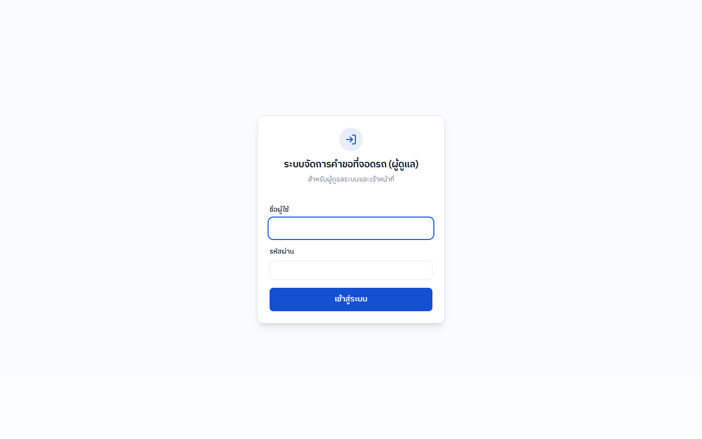
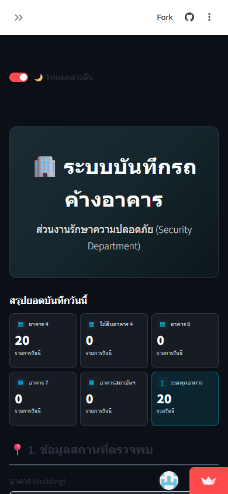

# BlueWhaleX Portfolio

Single-page bilingual portfolio for Kittiphum Prasomsap, presenting deployed work across Mega, Advanced, and Mini project tiers.

## Local preview

```bash
python -m http.server 4173
```

Open `http://localhost:4173/index.html`. The site is framework-free and does not require a build step.

## Structure

- `index.html` — canonical source and deployable entry point
- `bluewhalex-portfolio.html` — synchronized standalone alias
- `assets/images/` — brand, background, and live project screenshots
- `assets/images/projects/` — screenshots shown in the Mini project catalog
- `assets/videos/` — optimized hero and section video assets
- `AGENTS.md` / `CLAUDE.md` — project conventions for agents

Both HTML files must be kept in sync — an edit to one is not reflected in the other.

## Featured project screenshots

| Gen2 admin login | Overnight vehicle log (mobile) |
|---|---|
|  |  |

## Release

Current release: **v0.5**

Project screenshots shown in the Mini project catalog are captured from public production pages. Do not add screenshots containing credentials, personal records, vehicle registrations, or other operationally sensitive data.

## License

MIT — see [LICENSE](LICENSE).
